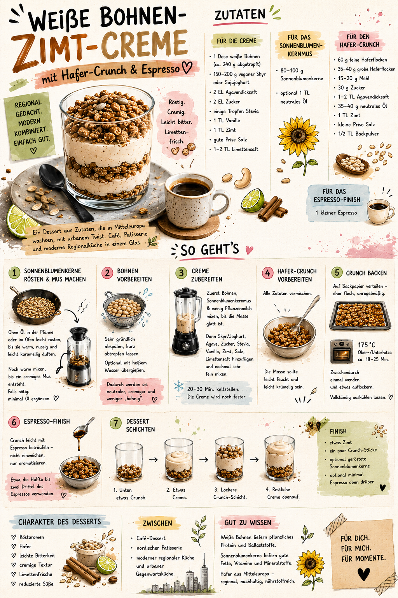
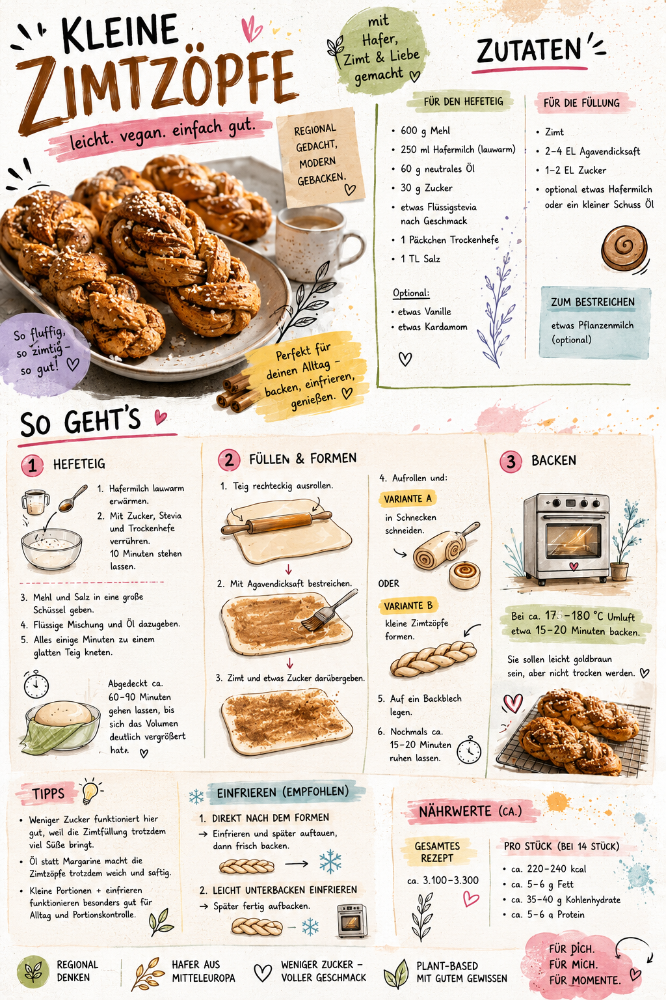

# Visual Reference Set

These images are internal art-direction references for the website and its generated asset series. They are not production website backgrounds, factual recipe sources, or templates to reproduce literally.

## White Bean Cinnamon Cream



**Role:** primary recipe-specific art-direction reference for the initial white bean cinnamon cream pilot.

Use it to understand:

- the balance between a realistic hero and illustrated supporting objects
- the warm paper, ink, watercolour, collage, and café-light treatment
- the desired editorial density and the relationship between hero, ingredients, steps, and notes
- the intended appearance of the layered dessert, espresso cup, oats, seeds, cinnamon, and lime at a conceptual level

Do not copy or trust its generated wording, quantities, typography, exact layout, or small decorative details. The Markdown recipe remains the factual source of truth.

## Cinnamon Buns



**Role:** secondary cross-recipe style reference.

Use it to identify the visual properties that remain stable when the food changes:

- one dominant photorealistic food scene
- simpler illustrated process objects
- irregular but controlled editorial grid
- loose brush highlights, thin rules, ink doodles, paper scraps, and sparse pigment splashes
- warm neutrals with small sage, pink, pale-blue, yellow, and terracotta accents
- playful contemporary energy without a childish cartoon or nostalgic country-house look

Do not use the buns, ingredients, utensils, or generated wording as references for the white bean dessert.

For the future small-cinnamon-braids recipe, this image becomes a **primary recipe-adjacent art-direction reference** for yeast-pastry atmosphere and series styling. It still does not define the exact braid shape, quantities, or preparation method; those require the written recipe and an approved factual shaping reference.

## Reference Order for the Initial Pilot

When both images are supplied to an image-generation request, identify them explicitly:

```text
Image 1: white bean cinnamon cream poster; primary recipe-specific mood, composition, and material reference only. Do not copy its text or exact page.
Image 2: cinnamon-bun poster; secondary cross-recipe style reference only. Use it to preserve the shared mixed-media language, not its food or props.
Image 3, when present: approved white bean dessert hero; authoritative anchor for food realism, lighting, palette, glassware, ceramics, and shadows.
Image 4, when present: factual subject reference only; it must not override the approved style.
```

It is not necessary to attach every reference to every generation. Use the smallest set that makes the required decisions unambiguous. After the hero is approved, it should carry more weight than either full-poster reference for all recipe-specific assets.
